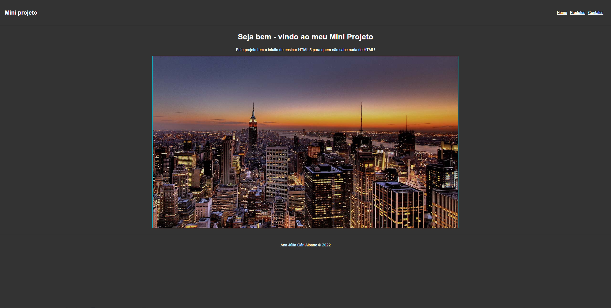

# Mini projeto HTML

Este repositório contém o primeiro site que criei, baseado na aula de HTML do YouTube do Matheus Batisti.

🔗 [Confira o projeto base aqui](https://www.youtube.com/watch?v=SV7TL0hxmIQ&t=2171s)

 ## Conceitos

- Introdução ao HTML

## Tecnologias

- HTML
- CSS
- Git and Github
